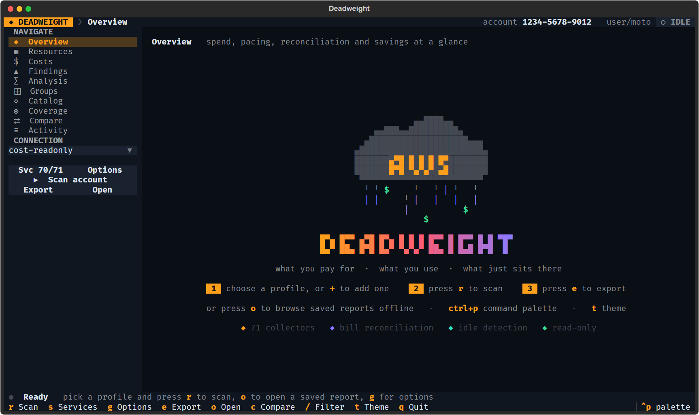
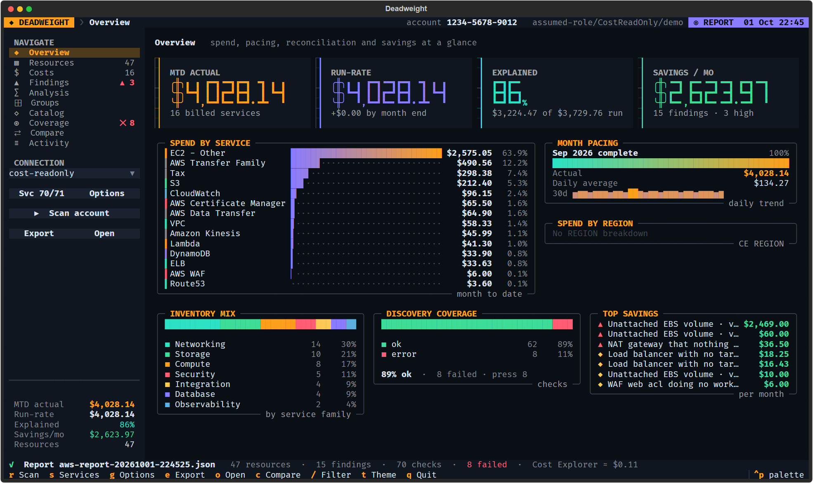
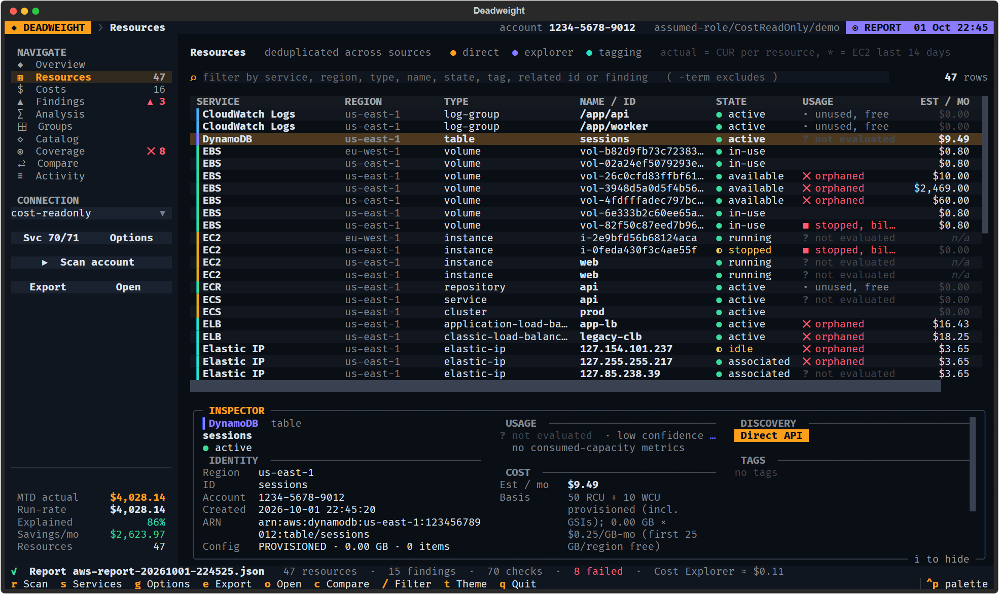
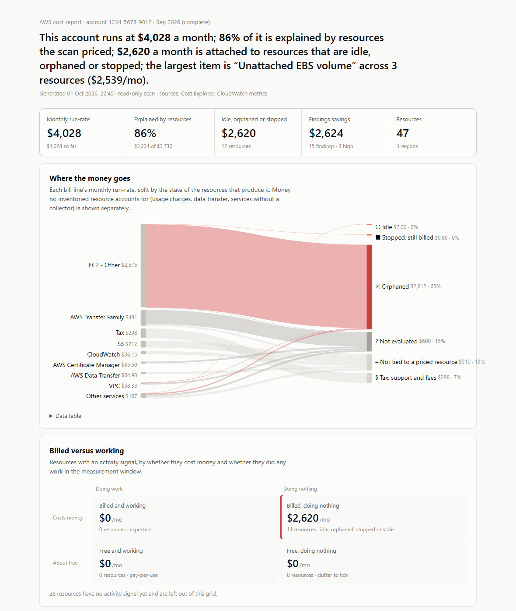

# Deadweight

**Find what you pay AWS for and don't use.** A read-only terminal app that inventories an AWS account,
matches every line of the bill to the resources behind it, and sorts those resources into working, idle
and forgotten.



It answers three questions:

- **What am I paying for?** Every Cost Explorer bill line, matched to the resources that produce it, with
  the share nothing accounts for shown separately.
- **What am I using?** Each resource gets a usage state from CloudWatch activity, references between
  resources and last-used dates.
- **What just sits there?** Idle NAT gateways, unattached volumes, load balancers without targets, stopped
  instances still paying for storage, and dozens more checks, each with an estimated monthly saving.



## Install

Python 3.11 or newer.

```bash
git clone <this repository> && cd deadweight
pip install .            # add ".[cur]" for per-resource costs from CUR / Data Exports
deadweight
```

No AWS profile yet? Pick **+ add profile…** in the profile list, or run `deadweight --add-profile`. It
supports IAM Identity Center sign-in (opens the browser, then lists your accounts and roles), access keys
and assume-role. Keys and roles are checked with AWS before anything is written, existing entries in
`~/.aws/config` and `~/.aws/credentials` are kept, and a `.bak` copy is made.

```bash
deadweight                                   # interactive
deadweight --report deadweight-reports/aws-report-<stamp>.json    # browse a saved scan offline
deadweight --headless --active-regions       # scan without the UI; write JSON, CSV and HTML
deadweight --diff old.json new.json          # what changed between two scans
deadweight --help
```

## It is read-only

Deadweight calls `Describe*`, `List*` and `Get*` APIs. It never creates, changes, enables or deletes
anything, and it does not read your data (no secret values, no queue messages, no objects other than the
billing export).

- Use a read-only role or profile. `deadweight --print-policy` prints a least-privilege IAM policy for the
  collectors you select.
- `--role-arn` assumes a role with the AWS-managed `ReadOnlyAccess` and `AWSBillingReadOnlyAccess` session
  policies, so the scan is read-only even if the role itself could write.
- Avoid scanning as the root user. Root cannot assume roles, and the scan flags root credentials as a finding.
- Calls that are denied show up in Coverage with the missing IAM action, and `p` lists them as a policy.

**What a scan costs.** Cost Explorer charges about $0.01 per request; the number of requests and the
approximate charge are shown after each scan. CloudWatch `GetMetricData` costs $0.01 per 1,000 metrics.
`--no-costs` and `--no-metrics` turn those off.

## How resources are classified



| State | Meaning |
|---|---|
| `active` | did measurable work in the window |
| `low-use` | did very little (for example a NAT gateway that moved under 1 GB in 30 days) |
| `idle` | exists and bills, did no work |
| `orphaned` | nothing references it: no route to the NAT, no targets behind the load balancer, no instance on the volume |
| `stopped-billed` | stopped, but still paying for storage or addresses |
| `stale` | not used in a long time (old snapshots, secrets nobody reads, log groups that never expire) |
| `clutter` | unused but free |
| `unknown` | no activity signal available |

Every verdict comes with its evidence ("0 bytes in 30 days", "no route table points here") and a
confidence. A few qualifiers adjust it:

- `too-new`: created inside the measuring window, so confidence is low.
- `excluded`: tagged `do-not-delete`, `keep`, `retain` or similar.
- `aws-agrees`: AWS Compute Optimizer independently marks it idle.
- `confirmed`: the same verdict on scans at least 7 days apart. First-seen dates are kept in
  `~/.cache/deadweight/usage-state.json`; `--no-usage-store` turns this off.

Missing CloudWatch datapoints count as zero only for metrics AWS publishes when non-zero (requests,
invocations, bytes). For CPU or connections, a missing day stays unknown. Public IPv4 addresses take on the
verdict of whatever holds them, so a saving is never counted twice.

## What it scans

71 collectors:

| | |
|---|---|
| Compute | EC2, Lambda, ECS and Fargate, EKS, App Runner, Lightsail, Batch, EMR, Elastic Beanstalk |
| Storage | S3, EBS volumes and snapshots, AMIs, EFS, FSx, ECR, Backup |
| Database | RDS and Aurora, DynamoDB, ElastiCache, MemoryDB, OpenSearch, OpenSearch Serverless, Redshift |
| Network | VPC, Elastic IPs and every public IPv4 address, NAT gateways, load balancers, API Gateway, CloudFront, Route 53, Resolver, Transit Gateway, VPN, Global Accelerator, Cloud Map, Direct Connect, Network Firewall |
| Security | KMS, Secrets Manager, WAF, Private CA, IAM hygiene, GuardDuty, Security Hub, CloudTrail, Config |
| Integration | SQS, SNS, Kinesis, Firehose, MSK, MQ, Step Functions, SES, Transfer Family, Glue, Athena |
| Observability | CloudWatch log groups, alarms and dashboards |
| AI | Bedrock, Bedrock AgentCore, SageMaker, Kendra |
| Discovery | Resource Explorer, the Tagging API, Cloud Control and AWS Config, to catch what the collectors above do not model |

Collectors run in parallel across regions (`--workers`, default 16). `--active-regions` scans only regions
with spend this month. `--org` scans every account in an AWS Organization through a read-only member role.
`--list-services` prints every collector; "Cloud Control (all types)" is opt-in because it lists hundreds
of resource types in every region.

No single AWS API lists everything in an account. Deadweight cross-checks several, reports every failed
call in Coverage rather than treating it as "nothing there", and flags bill lines that have spend but no
inventory.

## Costs

- **Actual:** Cost Explorer `UnblendedCost` for the month. Amortized and net-amortized costs are exported too.
  On the 1st of a month, the previous complete month is reported.
- **Run-rate:** month-to-date cost extended to the full month. AWS's own forecast is shown next to it.
- **Estimate:** list price for a resource's configuration, from the AWS Pricing API. `n/a` means it could
  not be priced; it never means free. Estimates exclude discounts, data transfer and per-request charges.
- **Per-resource actuals:** if the account has a Data Export (CUR 2.0) or a Parquet CUR, Deadweight finds
  it, aggregates the period locally with DuckDB and attaches the real cost to each resource, split into
  cost of existing (hours, storage) and cost of activity (requests, bytes). `--cur-path` reads local files.
- **Explained:** the share of the run-rate covered by priced resources. Tax, support and credits are left out.

Recommendations from Cost Optimization Hub and Compute Optimizer are included when the account has them.
Trusted Advisor and AWS Config "unused resource" rules are read when they are already set up.

## Reports

`e` in the app, or `--headless`, writes to `./deadweight-reports`:

- **JSON:** the whole scan. Reopen it with `--report`, or compare two with `--diff`.
- **CSV:** resources, costs, findings, reconciliation, billing breakdown, catalog.
- **HTML:** one self-contained file, light and dark, prints cleanly. `--html-style report` is the full
  version, `brief` is one printable page, `dashboard` is a wide two-column grid.
- **IAM policy:** the actions that were denied during the scan, as a policy you can attach.



Scan output contains account IDs, ARNs and resource names. The folder is git-ignored here; treat the files
as internal.

For cron or CI, `--budget N` exits 2 when the run-rate or forecast exceeds N, and `--fail-on high` exits 3
when findings of that severity exist.

## The app

| Key | View |
|---|---|
| `1` Overview | spend by service and region, month pacing, coverage, top savings |
| `2` Resources | every resource with state, usage, cost and findings; the inspector shows evidence, pricing basis, relations and tags |
| `3` Costs | each bill line with actual, run-rate, estimate and how much is explained |
| `4` Findings | ranked by saving; Enter jumps to the resource |
| `5` Analysis | Cost Explorer by usage type, operation, region, purchase type, tag or account |
| `6` Groups | inventory by CloudFormation stack, tag, VPC, region or account |
| `7` Catalog · `8` Coverage · `9` Compare · `0` Activity | |

`r` scan · `x` cancel · `+` add profile · `s` collectors · `g` options · `e` export · `o` open a saved
scan · `c` compare · `/` filter (`-term` excludes) · `i` inspector · `p` missing permissions · `t` theme ·
`ctrl+p` command palette · `q` quit.

## Status

Early. The collectors, classification rules and exports are covered by tests against mocked AWS
([moto](https://github.com/getmoto/moto)). The Trusted Advisor, Compute Optimizer idle and AWS Config
integrations were written against the API definitions and have had little exposure to real accounts.
Savings figures are estimates: check who owns a resource before deleting it. Bug reports with the
Coverage entry or the failing API call are very welcome.

## Development

```bash
pip install -e ".[dev]"
python -m pytest
```

See [CONTRIBUTING.md](CONTRIBUTING.md) for the rules (read-only, no real account data) and how to add a
collector.

## License

[Apache License 2.0](LICENSE).

Deadweight is an independent project, not affiliated with or endorsed by Amazon Web Services. "AWS" is a
trademark of Amazon.com, Inc. or its affiliates.
